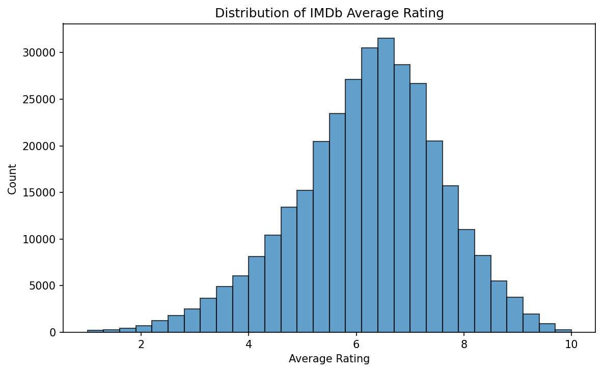
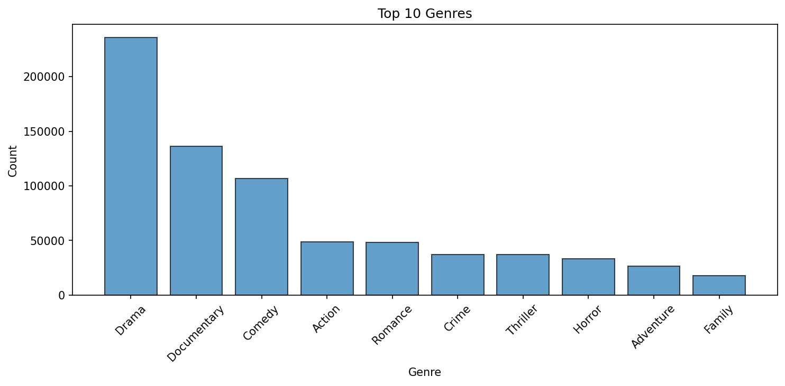
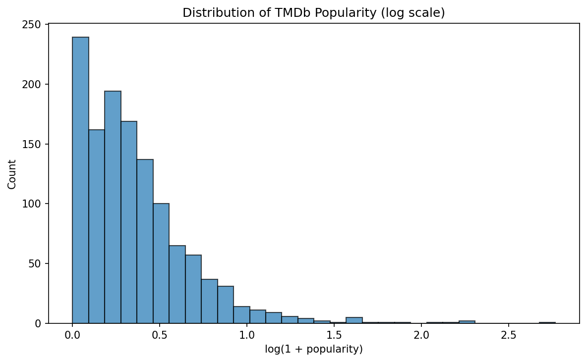
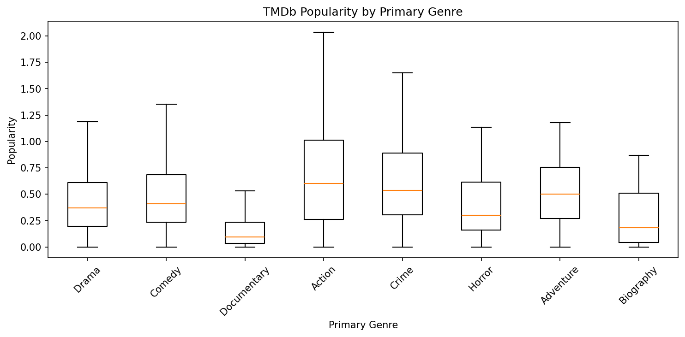
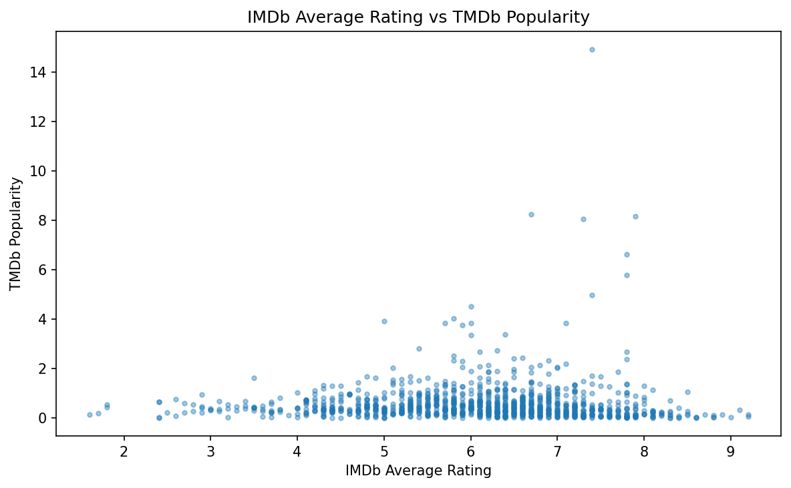
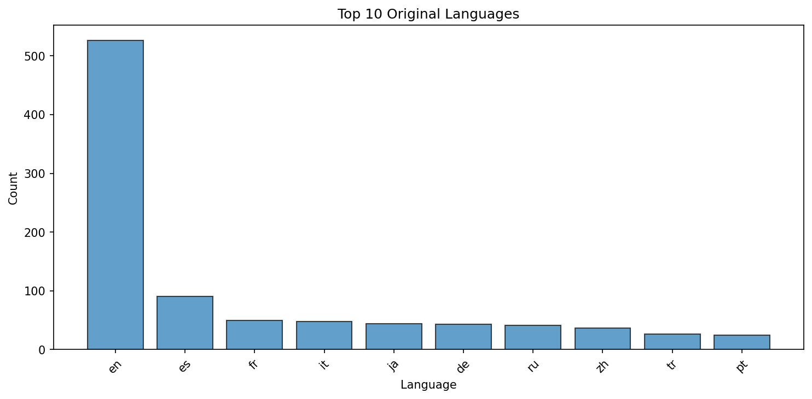

# Movie Popularity Analysis

## Project Title
**Analyzing and Predicting Movie Popularity from Genres and Categorical Features Using IMDb and TMDb Data**

## Overview
This project analyzes and predicts movie popularity by combining data from **IMDb** and **TMDb**. The main goal is to investigate how genres and other categorical movie features are associated with popularity, and whether these features can be used to build predictive models.

This project is developed as part of the **DSA 210 Introduction to Data Science** term project (Spring 2025-2026).

## Motivation
Movie success and popularity are influenced by many factors, including genre, release period, audience engagement, and metadata such as language or production-related attributes. By combining data from IMDb and TMDb, this project seeks to better understand which categorical features are most related to popularity and to explore whether movie popularity can be predicted from these variables.

## Data Sources
This project uses two public sources:

- **IMDb Non-Commercial Datasets** ([datasets.imdbws.com](https://datasets.imdbws.com/)): movie metadata including titles, genres, year, runtime, user ratings, and vote counts. ~551,000 movies after cleaning.
- **TMDb API** ([themoviedb.org](https://www.themoviedb.org/)): additional metadata including popularity scores, release dates, original language, and genre classifications. 2,000 movies sampled and enriched via API.

Using both sources satisfies the project requirement to enrich publicly available data with another data source.

## Project Progress

### Completed (Milestone 3 — April 14)

**Data Collection and Cleaning:**
- Loaded IMDb `title.basics` and `title.ratings` datasets
- Filtered to movies only (non-adult), merged with ratings
- Cleaned types, dropped nulls and duplicates → **551,041 rows**
- Enriched 2,000 sampled movies with TMDb API data (popularity, language, genres, vote counts)

**Exploratory Data Analysis:**

| Figure | Description |
|--------|-------------|
|  | IMDb ratings are roughly normally distributed around 6.0-7.0 |
|  | Drama, Documentary, and Comedy are the most common genres |
|  | TMDb popularity is heavily right-skewed; most movies have low popularity |
|  | Action and Adventure genres tend to have higher popularity |
|  | No strong linear relationship between IMDb rating and TMDb popularity |
|  | English dominates, followed by French, Japanese, and Spanish |

**Hypothesis Tests:**

All tests use significance level α = 0.05. Non-parametric tests were chosen because the popularity distribution is heavily right-skewed.

| Test | Method | Result | p-value |
|------|--------|--------|---------|
| A: Action vs non-Action popularity | Mann-Whitney U | **Reject H₀** — Action movies are significantly more popular (median 0.635 vs 0.364) | p < 0.001 |
| B: Popularity across top 5 genres | Kruskal-Wallis | **Reject H₀** — Popularity differs significantly across genres | p < 0.001 |
| C: IMDb rating vs TMDb popularity | Spearman correlation | **Reject H₀** — Weak negative correlation (ρ = −0.14) | p < 0.001 |

### Upcoming
- **May 5:** Apply ML models (Random Forest, Gradient Boosting) to predict popularity
- **May 18:** Final report and presentation

## Repository Structure
```
movie_popularity_analysis/
├── README.md
├── requirements.txt
├── .gitignore
├── DSA 210 Project Proposal.pdf
├── data/
│   ├── raw/                          # Raw IMDb TSV files (see data/raw/README.md)
│   │   ├── title.ratings.tsv.gz
│   │   └── README.md
│   └── processed/                    # Cleaned datasets
│       ├── movies_imdb_cleaned.csv   # 551K movies from IMDb
│       └── movies_imdb_tmdb_2000.csv # 2K movies enriched with TMDb
├── notebooks/
│   └── DSA210_Movie_Popularity_Analysis.ipynb
└── figures/                          # All generated plots
    ├── imdb_rating_distribution.png
    ├── imdb_votes_distribution.png
    ├── top10_genres.png
    ├── rating_vs_votes.png
    ├── tmdb_popularity_distribution.png
    ├── rating_vs_popularity.png
    ├── votes_vs_popularity.png
    ├── top10_languages.png
    ├── popularity_log_hist.png
    └── genre_popularity_boxplot.png
```

## How to Reproduce

1. Clone the repository:
   ```bash
   git clone https://github.com/korcanbaykall/movie_popularity_analysis.git
   cd movie_popularity_analysis
   ```

2. Install dependencies:
   ```bash
   pip install -r requirements.txt
   ```

3. Download the missing raw data file (`title.basics.tsv.gz` is ~210 MB and not included in the repo):
   ```bash
   wget -P data/raw/ https://datasets.imdbws.com/title.basics.tsv.gz
   ```

4. Open and run the notebook:
   ```bash
   jupyter notebook notebooks/DSA210_Movie_Popularity_Analysis.ipynb
   ```

   > **Note:** The TMDb API enrichment step is cached. The pre-fetched data is already in `data/processed/movies_imdb_tmdb_2000.csv`, so you don't need a TMDb API key to reproduce the analysis.

## Tools and Libraries
- Python 3.10+
- pandas, numpy — data manipulation
- matplotlib — visualization
- scipy — hypothesis testing
- requests — TMDb API calls
- jupyter — notebook environment
