# Movie Popularity Analysis

## Project Title
**Analyzing and Predicting Movie Popularity from Genres and Categorical Features Using IMDb and TMDb Data**

## Overview
This project analyzes and predicts movie popularity by combining data from **IMDb** and **TMDb**. The main goal is to investigate how genres and other categorical movie features are associated with popularity, and whether these features can be used to build predictive models.

This project is developed as part of the **DSA 210 Introduction to Data Science** term project (Spring 2025-2026).

## Motivation
Movie success and popularity are influenced by many factors, including genre, release period, audience engagement, and metadata such as language or production-related attributes. By combining data from IMDb and TMDb, this project seeks to better understand which categorical features are most related to popularity and to explore whether movie popularity can be predicted from these variables.

## Data Sources
This project uses two public sources:

- **IMDb Non-Commercial Datasets** ([datasets.imdbws.com](https://datasets.imdbws.com/)): movie metadata including titles, genres, year, runtime, user ratings, and vote counts. ~553,000 movies after cleaning.
- **TMDb API** ([themoviedb.org](https://www.themoviedb.org/)): additional metadata including popularity scores, release dates, original language, and genre classifications. 2,000 movies sampled and enriched via API.

Using both sources satisfies the project requirement to enrich publicly available data with another data source.

## Project Progress

**Data Collection and Cleaning:**
- Loaded IMDb `title.basics` and `title.ratings` datasets
- Filtered to movies only (general audience), merged with ratings
- Cleaned types, dropped nulls and duplicates → **553,802 rows**
- Enriched 2,000 sampled movies with TMDb API data (popularity, language, genres, vote counts)

**Exploratory Data Analysis:**

| Figure | Description |
|--------|-------------|
| 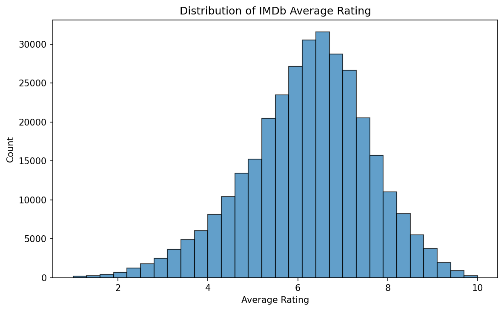 | IMDb ratings are roughly normally distributed around 6.0-7.0 |
| 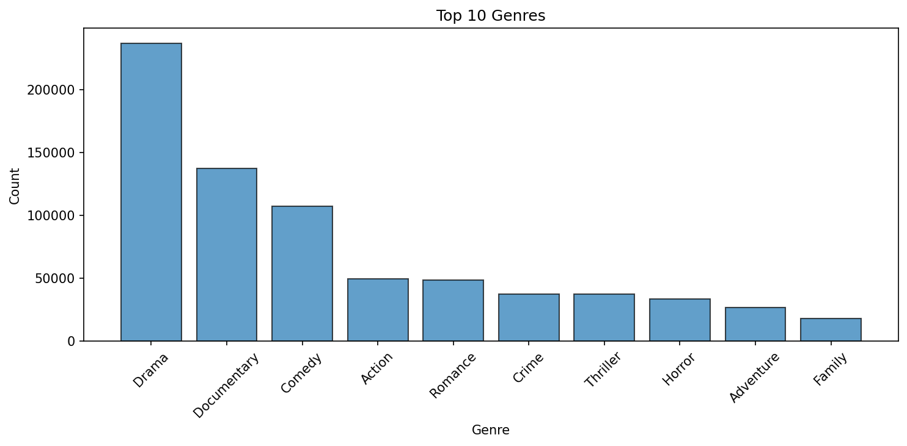 | Drama, Documentary, and Comedy are the most common genres |
| 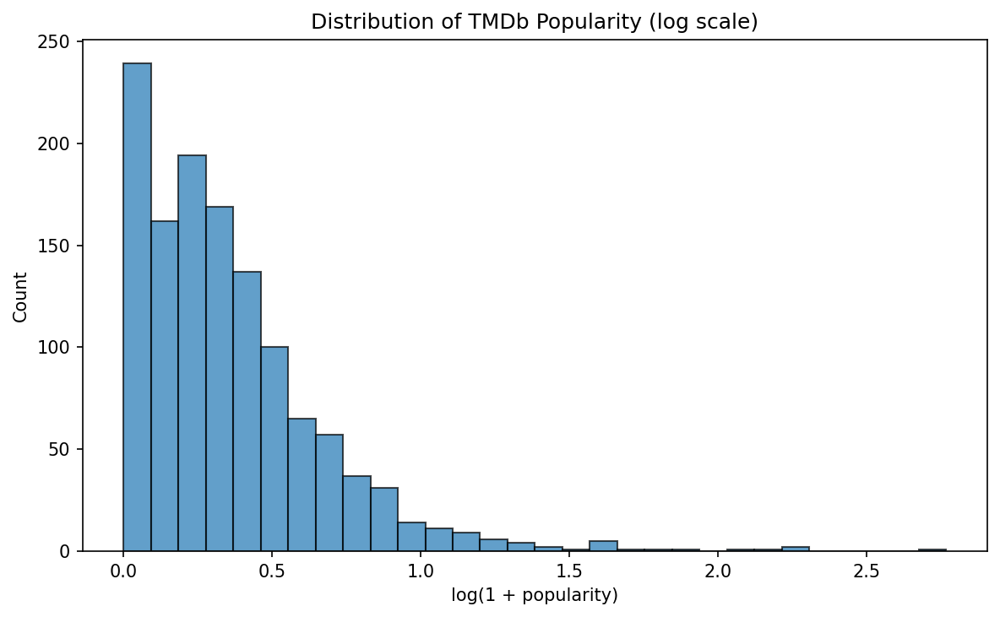 | TMDb popularity is heavily right-skewed; most movies have low popularity |
| 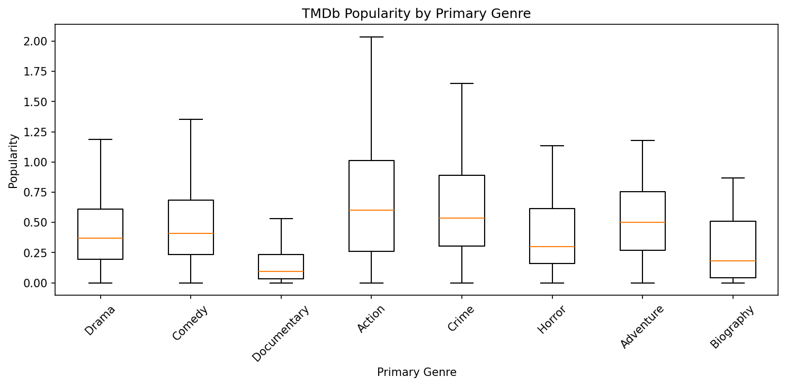 | Action and Adventure genres tend to have higher popularity |
| 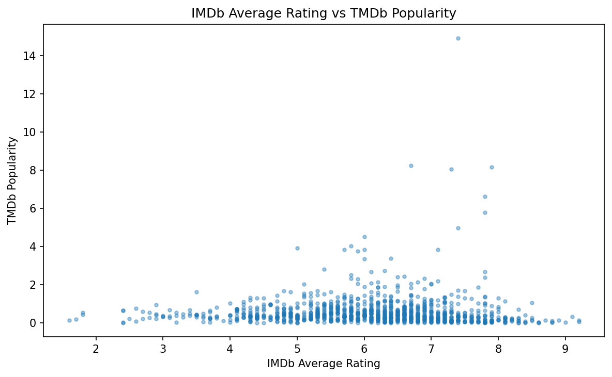 | No strong linear relationship between IMDb rating and TMDb popularity |
| 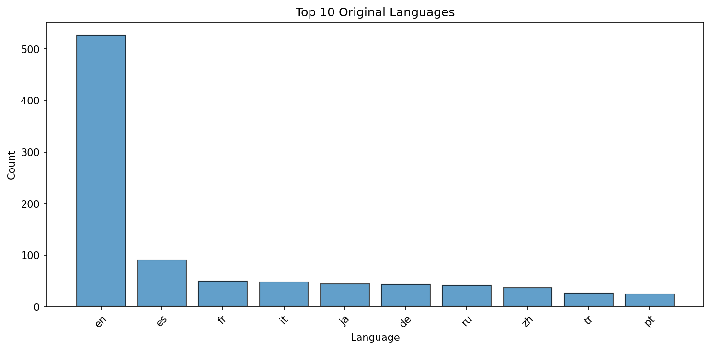 | English dominates, followed by French, Japanese, and Spanish |

**Hypothesis Tests:**

All tests use significance level α = 0.05. Non-parametric tests were chosen because the popularity distribution is heavily right-skewed.

| Test | Method | Result | p-value |
|------|--------|--------|---------|
| A: Popularity across top 5 genres (main question) | Kruskal-Wallis | **Reject H₀** — Popularity differs significantly across genres | p < 0.001 |
| B: Action vs non-Action popularity | Mann-Whitney U | **Reject H₀** — Action movies are significantly more popular (median 0.635 vs 0.364) | p < 0.001 |
| C: IMDb rating vs TMDb popularity | Spearman correlation | **Reject H₀** — Weak negative correlation (ρ = −0.14) | p < 0.001 |

**Machine Learning (section 9 of the notebook):**

968 movies with all features non-null are used. 80/20 train-test split, stratified on the classification target, `random_state=42`. 5-fold cross-validation on the training set checks stability.

**Two feature sets are evaluated side by side:**

- **Full features** — `runtimeMinutes`, `averageRating`, `log_numVotes`, `startYear`, decade, top-8 language, multi-hot genres.
- **Metadata-only** — same set with `averageRating` and `log_numVotes` removed. `numVotes` correlates 0.62 (Spearman) with popularity and is essentially a popularity proxy; the metadata-only set is the one that matches the proposal's framing ("can categorical features alone predict popularity?").

**Regression — predicting `log1p(popularity)`** (4 models per feature set: median baseline, Linear Regression, Random Forest, Gradient Boosting). Best model per feature set on the held-out test set:

| Feature set | Best model | R² | MAE | RMSE | CV R² |
|---|---|---|---|---|---|
| Full | Gradient Boosting | **0.594** | 0.146 | 0.208 | 0.490 |
| Metadata-only | Random Forest | **0.306** | 0.197 | 0.272 | 0.177 |
| Metadata-only (tuned GB, GridSearchCV) | Gradient Boosting | **0.319** | 0.196 | 0.269 | 0.177 |
| Either | Median baseline | −0.066 | 0.229 | 0.337 | — |

Tuned GB on metadata-only used `n_estimators=200, max_depth=2, learning_rate=0.05` (best of a 2 × 3 × 3 grid). The ~0.28 R² gap between the two feature sets is the share of predictive power carried by `numVotes` as a popularity proxy.

**Classification — popular (top 25%) vs not** (Logistic Regression and Random Forest use `class_weight='balanced'` to handle the 25/75 imbalance):

| Feature set | Best model | Accuracy | Precision | Recall | F1 | ROC-AUC |
|---|---|---|---|---|---|---|
| Full | Random Forest | 0.856 | 0.738 | 0.646 | 0.689 | **0.878** |
| Full | Gradient Boosting | 0.845 | 0.750 | 0.562 | 0.643 | 0.875 |
| Metadata-only | Random Forest | 0.789 | 0.581 | 0.521 | 0.549 | **0.801** |

Class balancing brings popular-class recall up from ~0.48 (unweighted) to 0.65 on the full feature set, with only a ~1 point AUC change.

**Top features (Gradient Boosting):** Full set is dominated by `log_numVotes`, then `averageRating`. Metadata-only set leans on `runtimeMinutes`, `startYear`, and a small genre cluster (`Documentary`, `Thriller`, `Action`, `Sci-Fi`); Japanese-language and English-language flags also matter.

| Figure | Description |
|--------|-------------|
| 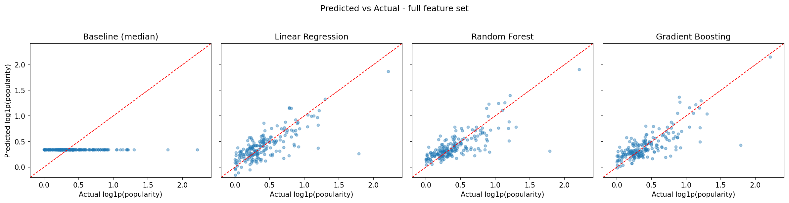 | Predicted vs actual `log1p(popularity)` per regressor — full features |
| 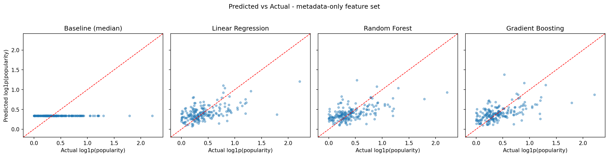 | Predicted vs actual — metadata-only features |
| 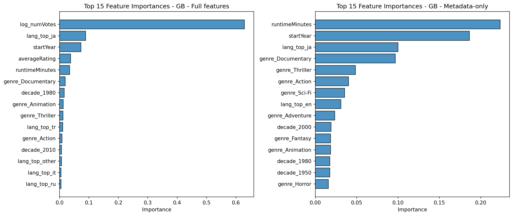 | Top 15 Gradient Boosting feature importances, full vs metadata-only |
| 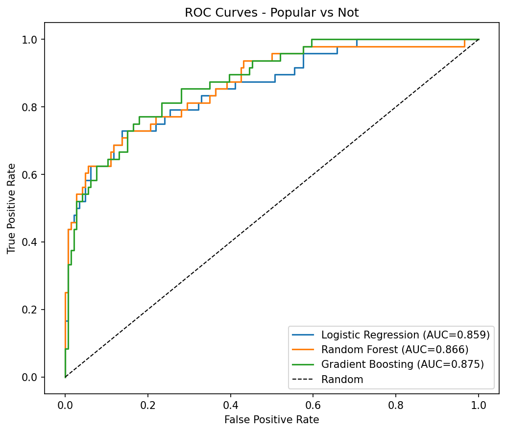 | ROC curves for the three classifiers, full vs metadata-only |
| 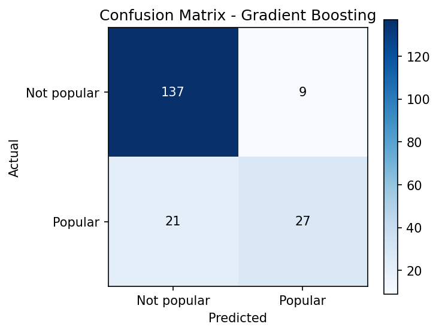 | Confusion matrices for the best classifier on each feature set |

## Repository Structure
```
movie_popularity_analysis/
├── README.md
├── requirements.txt
├── .gitignore
├── DSA 210 Project Proposal.pdf
├── data/
│   ├── raw/                          # Raw IMDb TSV files (see data/raw/README.md)
│   │   ├── title.ratings.tsv.gz
│   │   └── README.md
│   └── processed/                    # Cleaned datasets
│       ├── movies_imdb_cleaned.csv   # 553K movies from IMDb
│       └── movies_imdb_tmdb_2000.csv # 2K movies enriched with TMDb
├── notebooks/
│   └── DSA210_Movie_Popularity_Analysis.ipynb
└── figures/                          # All generated plots
    ├── imdb_rating_distribution.png
    ├── imdb_votes_distribution.png
    ├── top10_genres.png
    ├── rating_vs_votes.png
    ├── tmdb_popularity_distribution.png
    ├── rating_vs_popularity.png
    ├── votes_vs_popularity.png
    ├── top10_languages.png
    ├── popularity_log_hist.png
    ├── genre_popularity_boxplot.png
    ├── ml_pred_vs_actual_full.png
    ├── ml_pred_vs_actual_meta.png
    ├── ml_feature_importance.png
    ├── ml_roc_curves.png
    └── ml_confusion_matrix.png
```

## How to Reproduce

1. Clone the repository:
   ```bash
   git clone https://github.com/korcanbaykall/movie_popularity_analysis.git
   cd movie_popularity_analysis
   ```

2. Install dependencies:
   ```bash
   pip install -r requirements.txt
   ```

3. Download the missing raw data file (`title.basics.tsv.gz` is ~210 MB and not included in the repo):
   ```bash
   wget -P data/raw/ https://datasets.imdbws.com/title.basics.tsv.gz
   ```

4. Open and run the notebook:
   ```bash
   jupyter notebook notebooks/DSA210_Movie_Popularity_Analysis.ipynb
   ```

   > **Note:** The TMDb API enrichment step is cached. The pre-fetched data is already in `data/processed/movies_imdb_tmdb_2000.csv`, so you don't need a TMDb API key to reproduce the analysis.

## Tools and Libraries
- Python 3.10+
- pandas, numpy — data manipulation
- matplotlib — visualization
- scipy — hypothesis testing
- scikit-learn — ML models and evaluation
- requests — TMDb API calls
- jupyter — notebook environment
